# Rubbish API Integration with Google Sheets via Zapier

Welcome to the guide on how to integrate Rubbish's "Get all Issues" route with Google Sheets using Zapier. This step-by-step tutorial will help you automatically populate a Google Sheet with reports from the Rubbish app. Customize the columns with your preferred data, and the Rubbish API will fill each associated column automatically. This documentation applies to all Zapier integrations, including getting all incident report ticket, getting rubbish runs completed on the Rubbish app, as well as getting specific movement information about a specific rubbish run.

Before we start, here's the necessary route information:

Routes: 
- `https://qr-dev.rubbish.love/public/api/v1/reports/{:teamId}/get`
- `https://qr-dev.rubbish.love/public/api/v1/runs/{:teamId}/get`
- `https://qr-dev.rubbish.love/public/api/v1/runs/{:teamId}/movement/{:runId}`

Required: Bearer token

## Table of Contents

- [Step 1: Create a Zap](#create-zap)
- [Step 2: Create a Trigger](#create-trigger)
- [Step 3: Create an Action](#create-action)

## Step 1: Create a Zap

From the Zapier dashboard, click "Create a Zap".

## Step 2: Create a Trigger

1. Find the Rubbish app in the search area.
   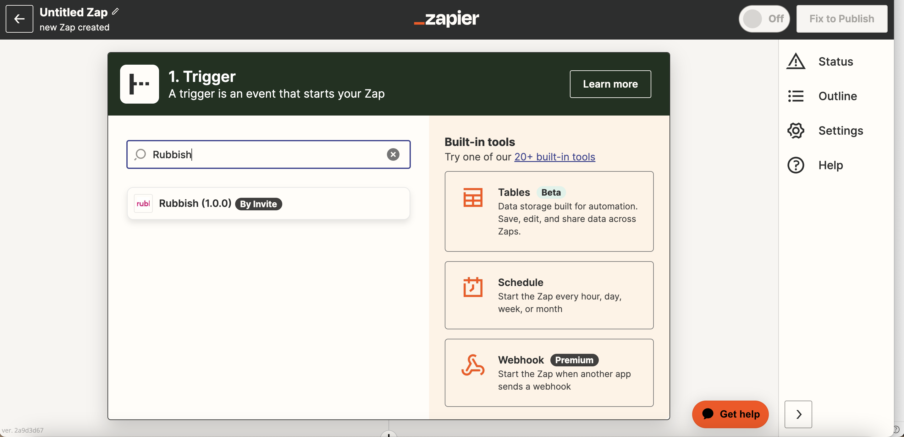

2. In the field that prompts you to choose an event, select "Get all issues", and click "Next".
   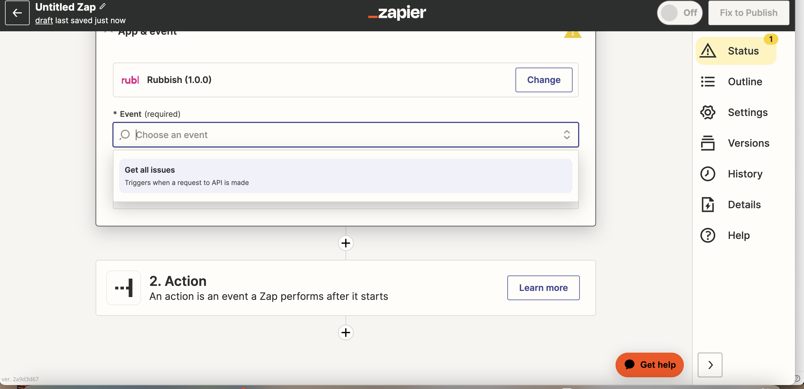

3. Now, create a Rubbish account. A new window will open prompting you to enter your Bearer token.
   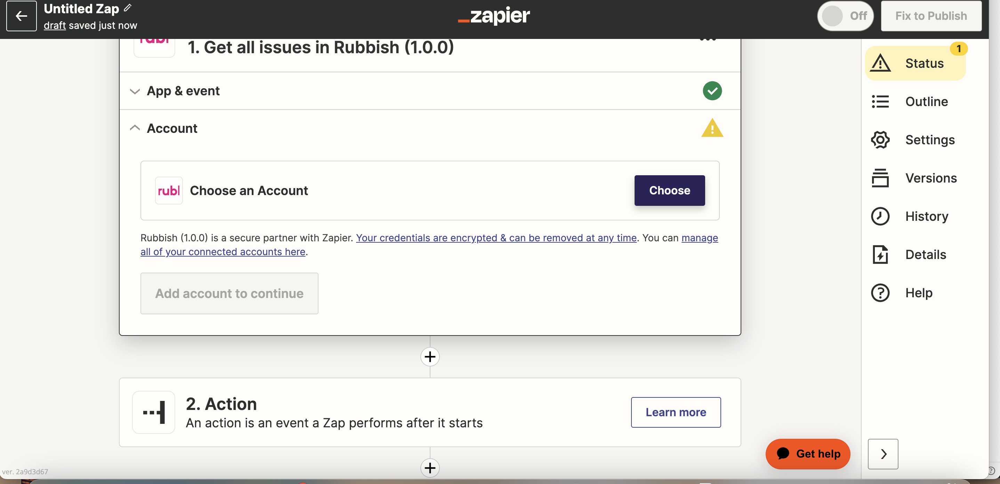
   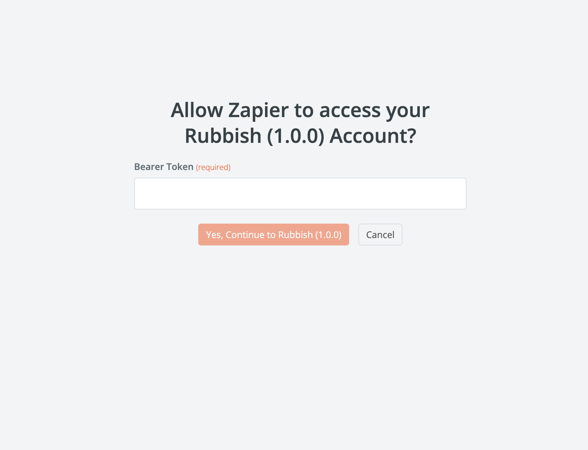
    \* Note: Email the Rubbish team if you don't have a Bearer token to log in.

4. Once the account is approved, proceed to the next step and test the trigger to ensure you are receiving incident tickets. If successful, continue to the next step.
   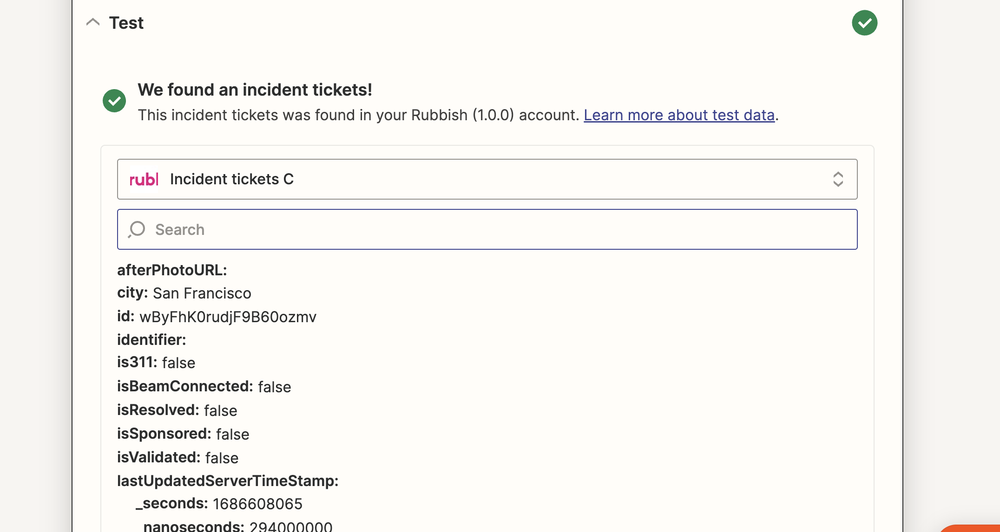

## Step 3: Create an Action

1. Associate the Action with Google Sheets.
   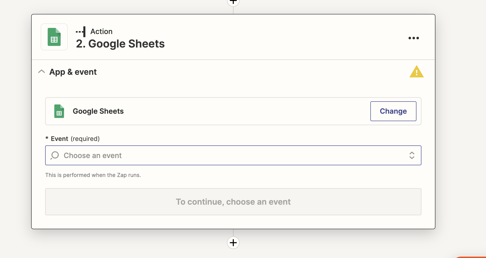

2. Choose "Create multiple spreadsheet rows" as the option.
   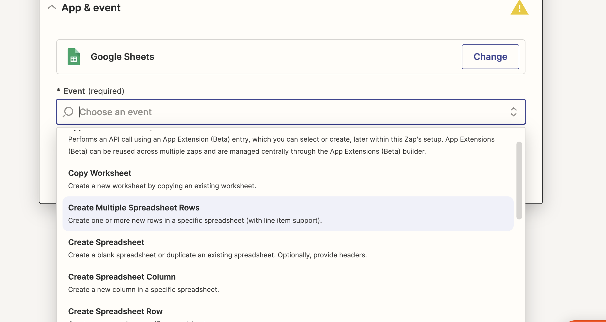

3. Log in with your Google account.
   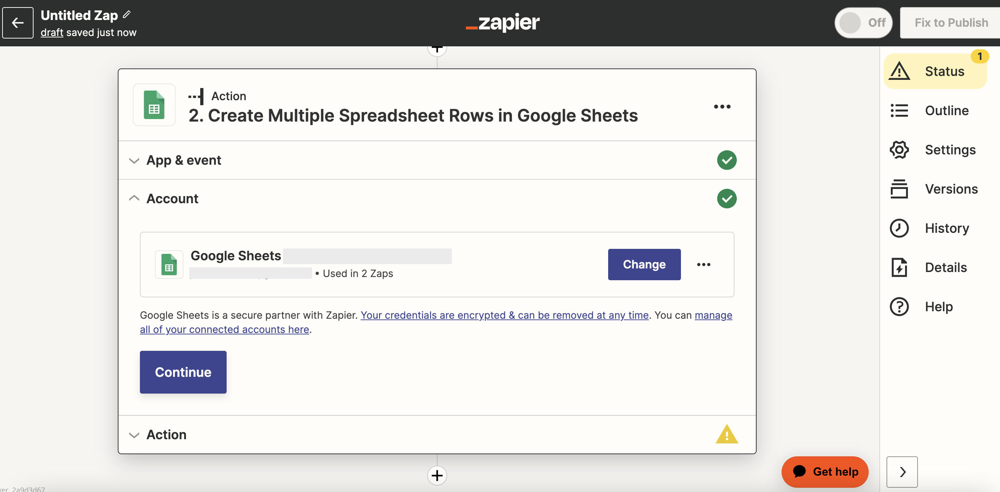

4. Under the Actions section, select the Google sheet you want to use. You can use an existing document or create a new sheet.
   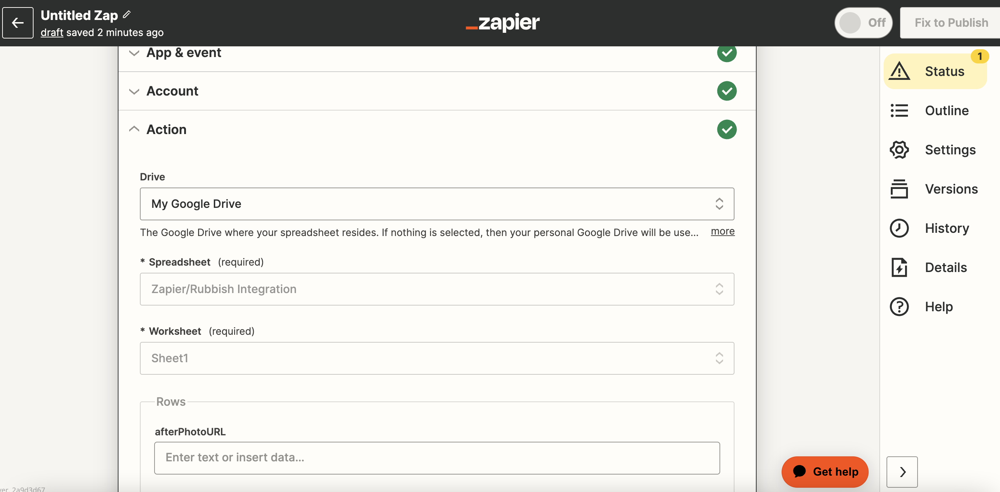

5. To map out the rows to the data received, copy and paste this into the first row of your Google Sheet document:

| After Photo URL | City | Comments | ID  | Identifier | Is Beam Connected | Is Resolved | Last Updated Server Time Stamp | Last Updated User Time Stamp | Lat | Location | Long | Model Version | Photo Story ID | Photo Submission State | Photo URL | Picked Up | Posted By User Role | Privacy Level | QR Code ID | Reported At  | Reported Time Stamp | Reporter Email | Rubbish Run ID | Rubbish Type | Rubbish Type ID | Rubbish Type Lower Case Search Identifier | Server Time Stamp  | State | Status | Street | Subscribe To Newsletter | Team Display Name | Team ID    | Total Number Of Items Tagged | User Agent | User IP Address | User Name | User Profile Photo URL | User Time Stamp |
| --------------- | ---- | -------- | --- | ---------- | ----------------- | ----------- | ------------------------------ | ---------------------------- | --- | -------- | ---- | ------------- | -------------- | ---------------------- | --------- | --------- | ------------------- | ------------- | ---------- | ------------ | ------------------- | -------------- | -------------- | ------------ | --------------- | ----------------------------------------- | ------------------ | ----- | ------ | ------ | ----------------------- | ----------------- | ---------- | ---------------------------- | ---------- | --------------- | --------- | ---------------------- | --------------- |
| Example URL     | City | Comments | ID  | Identifier | false             | false       | Example Time Stamp             | Example Time Stamp           | 0   | Location | 0    | 420           | Example ID     | awaitingReview         |           | false     | genericWeb          | privacyTeam   | NONE       | Example Time | Example Time        |                |                | Example Type | Example Type ID | example-type-lower-case-search-identifier | Example Time Stamp |       | Status | Street | false                   | Example Team      | Example ID | 1                            | Example UA | 12.34.56.78     |           |                        | Example Time    |

Note: You can limit this to only include the columns you're interested in.

6. Next, ensure the headings in your Google Sheets correspond to the each data point returned from the Rubbish App. You can search each key in the search bar that appears when you click into each row input field.
   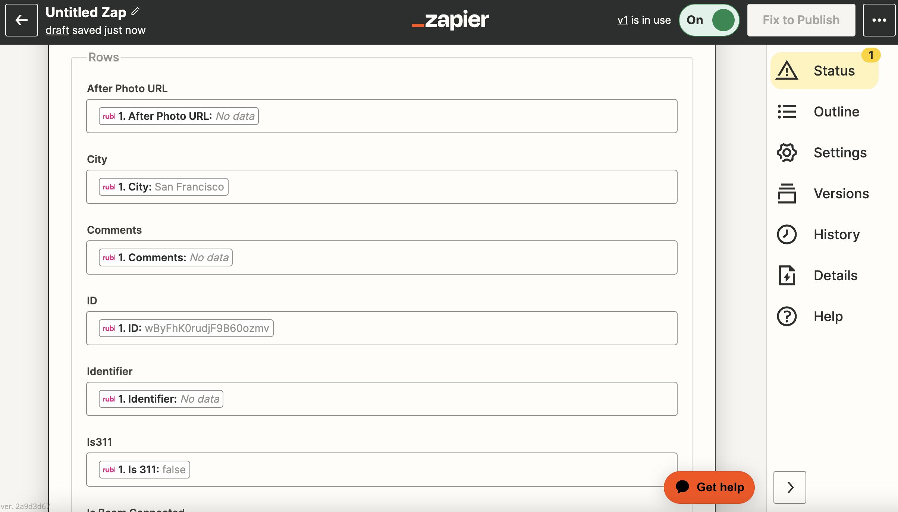
   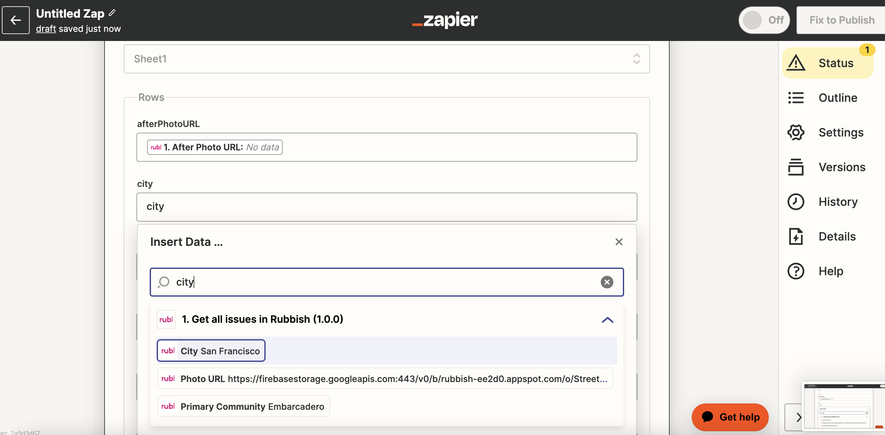

7. Once done, test the action to verify the information is correctly entered into your Google Sheets document.
   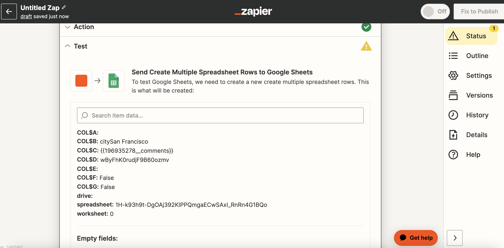
   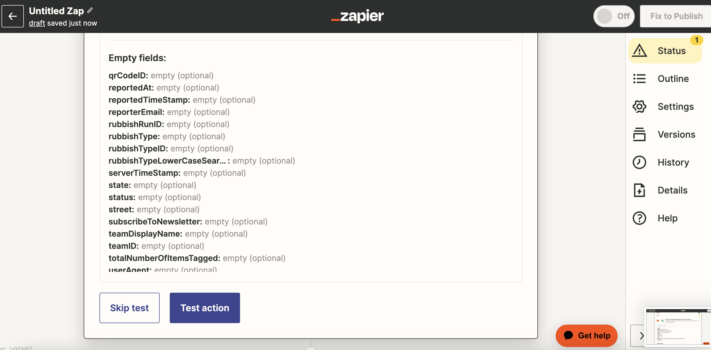
   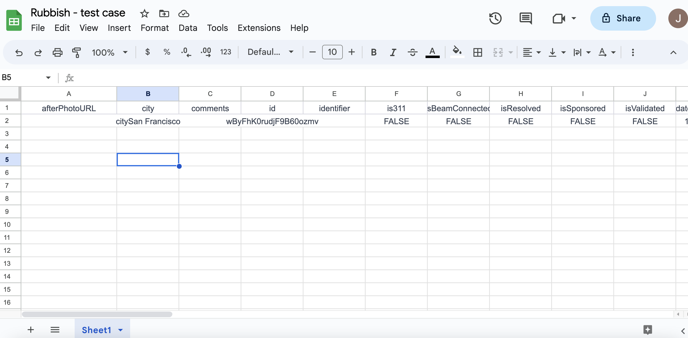

8. After you see the test data in your Google Sheets, hit "Publish".
   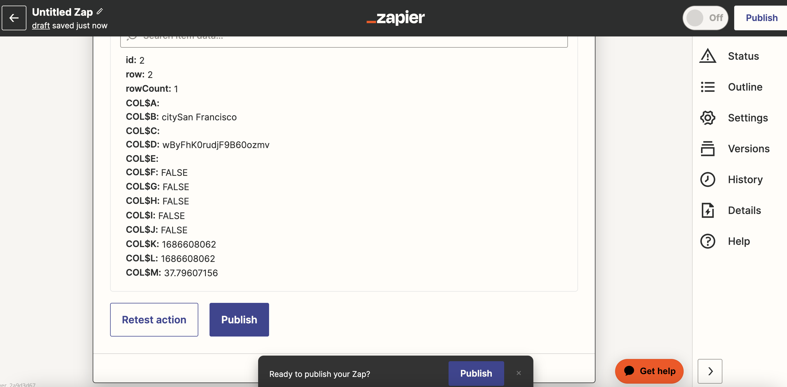
   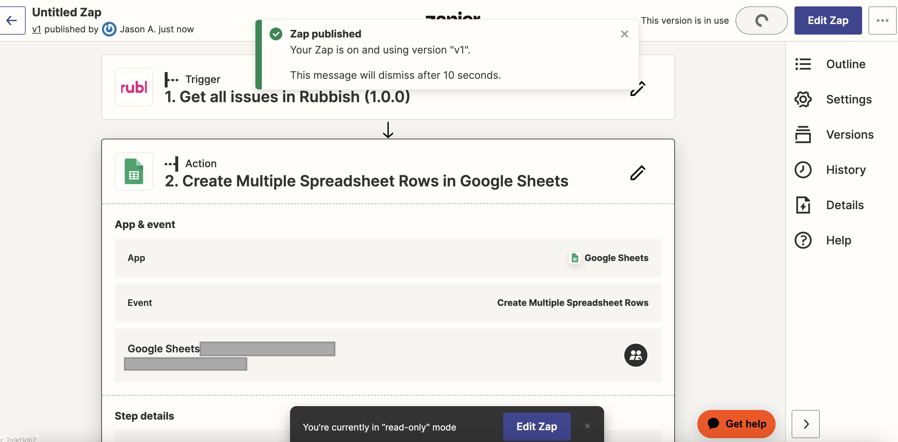

Congratulations! Your document will now update periodically with data from the Rubbish API.
